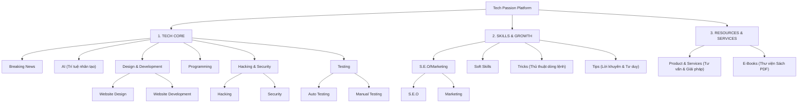

# TECH PASSION — PERSONALIZED TECH MEDIA & KNOWLEDGE PLATFORM

> **Nền tảng tri thức công nghệ và cổng truyền thông kiến thức chuyên sâu dành riêng cho Software Engineers.**  
> Thiết kế chuẩn mực, tối giản tuyệt đối, siêu tốc độ, không widget rườm rà, tập trung 100% vào trải nghiệm đọc và giá trị kỹ thuật thực chiến.

---

## 1. TỔNG QUAN KIẾN TRÚC & PHÂN CẤP TRI THỨC

Hệ thống được cấu trúc khoa học theo **3 Cụm Tri thức**, bao gồm **12 Trụ Cột (Pillars)** và **8 Danh mục con (Sub-items)**:



---

## 2. BỘ CÔNG NGHỆ CHUẨN (TECH STACK)

- **Frontend**: **Next.js 15 (App Router)** + **React 19** + **TypeScript** + **Tailwind CSS** + **Lucide Icons**.
  - Kích thước Bundle cực nhẹ (~103 kB - 117 kB First Load JS).
  - Tích hợp chuẩn SEO quốc tế: `sitemap.xml`, `robots.txt`, OpenGraph và Schema.org JSON-LD (`TechArticle`, `BreadcrumbList`).
- **Backend API**: **Node.js 20+** + **TypeScript** + **Express** (Kiến trúc Modular Monolith).
  - Tự động fallback In-Memory khi chạy độc lập không cần database.
  - Logging cấu trúc cao tốc qua Pino Logger.
- **Cơ sở dữ liệu Lai (Polyglot Persistence)**:
  - **MySQL 8.0**: Lưu trữ quan hệ ACID (Người dùng, Cây danh mục 12 Pillars & 8 Sub-items, Gói dịch vụ, Khách hàng tư vấn `service_inquiries`).
  - **MongoDB 7.0**: Lưu trữ văn bản phi cấu trúc (Bài viết MongoDB Document với `category_path` Topic Silo, E-Books, Tricks, Tips).
  - **Redis 7.0**: Cache bộ nhớ nhanh Mega-Menu 3 Cụm và tin tức khẩn cấp.
- **Containerization**: **Docker** & **Docker Compose** 5 dịch vụ đồng bộ.

---

## 2.1. HỆ THỐNG BẢO MẬT ĐA TẦNG (DEFENSE-IN-DEPTH SECURITY)

Dự án áp dụng tiêu chuẩn bảo mật khắt khe theo **OWASP Top 10** và nguyên tắc **Zero Trust**, bảo vệ toàn diện từ Reverse Proxy đến Cơ sở dữ liệu:

1. **Bảo Mật Tầng Ứng Dụng & Headers (Next.js 15 & Express Helmet)**:
   - **Content-Security-Policy (CSP)**: Chặn đứng tấn công XSS (Cross-Site Scripting) và Data Exfiltration.
   - **X-Frame-Options: DENY**: Chống tấn công Clickjacking.
   - **X-Content-Type-Options: nosniff**: Chống tấn công MIME-type sniffing.
   - **Strict-Transport-Security (HSTS)**: Bắt buộc truyền thông mã hóa TLS/HTTPS.
   - **Ẩn dấu vết phần mềm**: Loại bỏ hoàn toàn header `X-Powered-By: Express` và `X-Powered-By: Next.js` để tránh bị hacker quét lỗ hổng theo phiên bản.

2. **Chống Tấn Công Từ Chối Dịch Vụ & Dò Quét (Rate Limiting & Anti-Brute-Force)**:
   - **Global Rate Limiter**: Giới hạn tối đa 120 request/phút trên mỗi địa chỉ IP.
   - **Anti-Brute-Force Login**: Giới hạn tối đa 5 lần đăng nhập sai trong 15 phút, tự động khóa tạm thời IP vi phạm.
   - **Inquiry Spam Limiter**: Giới hạn form tư vấn dịch vụ (5 request/10 phút) kết hợp **Anti-Bot Honeypot Field** bẫy bot tự động vô hình.

3. **Chống Tấn Công Tiêm Mã Độc (Anti-Injection)**:
   - **NoSQL Injection**: Bộ lọc `securitySanitizer` đệ quy quét sạch toàn bộ `req.body`, `req.query`, `req.params`, bóc tách và vô hiệu hóa mọi toán tử MongoDB nguy hiểm (`$gt`, `$ne`, `$regex`, `$where`).
   - **SQL Injection**: 100% truy vấn MySQL sử dụng Parameterized Prepared Statements (`?`).

4. **Kiểm Soát Truy Cập & Phân Quyền (RBAC & JWT Gatekeeper)**:
   - Toàn bộ trang `/admin` và các API nhạy cảm (`POST /posts`, `GET /inquiries`, `PATCH /inquiries/:id`) đều được bảo vệ bằng chữ ký số JWT 256-bit. Người dùng chưa xác thực sẽ bị chặn 401 Unauthorized ngay lập tức.

5. **Bảo Mật Reverse Proxy Nginx**:
   - `server_tokens off;` che giấu danh tính Nginx.
   - Chặn truy cập tuyệt đối các file cấu hình và mã nguồn nhạy cảm (`.env`, `.git`, `.sql`, `.bak`, `.log`).
   - Chặn tự động các công cụ quét lỗ hổng tự động của hacker (`sqlmap`, `nikto`, `wpscan`, `acunetix`).

---

## 3. CẤU TRÚC THƯ MỤC DỰ ÁN

```
Tech Passion/
├── docker-compose.yml              # Quản lý 5 container: frontend, backend, mysql, mongodb, redis
├── .env.example                    # Cấu hình biến môi trường mẫu
├── PROJECT_SPEC.md                 # Tài liệu đặc tả kỹ thuật chi tiết
├── README.md                       # Hướng dẫn cài đặt và vận hành
│
├── infrastructure/                 # Hạ tầng cơ sở dữ liệu & mạng
│   ├── database/
│   │   └── mysql-init.sql          # DDL tạo bảng & Seed Data đầy đủ 12 Pillars + 8 Sub-items
│   └── nginx/
│       └── default.conf            # Cấu hình Reverse Proxy & SSL Nginx
│
├── backend/                        # Backend RESTful API (Node.js + TypeScript)
│   ├── Dockerfile                  # Multi-stage Dockerfile
│   ├── package.json
│   ├── tsconfig.json
│   └── src/
│       ├── config/                 # mysql.ts, mongodb.ts, redis.ts, env.ts, logger.ts
│       ├── common/                 # response.ts, error handling
│       └── modules/                # categories, posts, services, quick-notes, ebooks, health
│
└── frontend/                       # Frontend Next.js 15 App Router
    ├── Dockerfile                  # Multi-stage Dockerfile
    ├── package.json
    ├── tailwind.config.ts
    ├── src/
    │   ├── app/
    │   │   ├── page.tsx            # Trang chủ: Hero, 12 Danh mục, Bài mới, Banner dịch vụ
    │   │   ├── [pillarSlug]/       # Topic Silo Dynamic Routing
    │   │   │   ├── page.tsx        # Tự động hiển thị Tab Bar khi có Sub-items
    │   │   │   ├── [subSlug]/page.tsx
    │   │   │   ├── [subSlug]/[postSlug]/page.tsx
    │   │   │   └── post/[postSlug]/page.tsx
    │   │   ├── tricks/page.tsx     # Thủ thuật dòng lệnh (1-Click Copy code snippet)
    │   │   ├── tips/page.tsx       # Lời khuyên công nghệ & Best practices
    │   │   ├── ebooks/page.tsx     # Thư viện sách PDF chính thống
    │   │   ├── product-services/page.tsx # Showcase dịch vụ & Form đăng ký tư vấn
    │   │   ├── admin/page.tsx      # Admin Console: Thống kê, Soạn thảo Markdown, Quản lý Leads
    │   │   ├── sitemap.ts          # Tự động sinh /sitemap.xml
    │   │   └── robots.ts           # Tự động sinh /robots.txt
    │   ├── components/             # Header, MegaMenu, BreakingNewsTicker, Footer, ArticleView
    │   └── lib/                    # api.ts (REST client & Fallback dữ liệu)
```

---

## 4. HƯỚNG DẪN KHỞI CHẠY HỆ THỐNG

### Cách 1: Khởi chạy Production bằng Docker Compose (Khuyên dùng)

Yêu cầu máy chủ đã cài đặt **Docker** và **Docker Compose**:

```bash
# 1. Di chuyển vào thư mục dự án
cd "d:\Vibe Coding\Tech Passion"

# 2. Khởi chạy toàn bộ 5 dịch vụ ngầm trong nền
docker compose up -d --build

# 3. Kiểm tra trạng thái các container
docker compose ps
```

Sau khi khởi chạy:
- **Frontend App**: `http://localhost:3000`
- **Backend API**: `http://localhost:4000/api/v1`
- **Healthcheck Endpoint**: `http://localhost:4000/api/v1/health`
- **Admin Console**: `http://localhost:3000/admin`
- **Sitemap XML**: `http://localhost:3000/sitemap.xml`
- **Robots TXT**: `http://localhost:3000/robots.txt`

---

### Cách 2: Khởi chạy Cục bộ Không Dùng Docker (Dành cho Development)

Backend và Frontend được tích hợp sẵn cơ chế **Offline Fallback**, bạn có thể chạy ngay trên Antigravity IDE hoặc Visual Studio Code mà không cần bật cơ sở dữ liệu:

#### Bước 1: Khởi chạy Backend API
```powershell
cd "d:\Vibe Coding\Tech Passion\backend"
npm run dev
# Server lắng nghe tại http://localhost:4000
```

#### Bước 2: Khởi chạy Frontend Next.js
Mở một cửa sổ Terminal mới:
```powershell
cd "d:\Vibe Coding\Tech Passion\frontend"
npm run dev
# Giao diện người dùng tại http://localhost:3000
```

---

## 5. THÔNG TIN QUẢN TRỊ & MẶC ĐỊNH

| Dịch vụ / Tài khoản | Thông tin kết nối |
| :--- | :--- |
| **Trang chủ Website** | `http://localhost:3000` |
| **Admin Portal** | `http://localhost:3000/admin` |
| **Backend REST API** | `http://localhost:4000/api/v1` |
| **Tài khoản Super Admin** | Email: `admin@techpassion.dev` <br> Password: `Admin@TechPassion2026` |
| **MySQL Database** | Host: `localhost:3306` <br> DB: `tech_passion_db` <br> User: `tp_user` / Pass: `tp_secret` |
| **MongoDB Database** | Host: `localhost:27017` <br> DB: `tech_passion_content` <br> User: `tp_mongo_user` / Pass: `tp_mongo_secret` |
| **Redis Cache** | Host: `localhost:6379` |

---

## 6. DANH SÁCH ENDPOINTS CHÍNH

- `GET /api/v1/health`: Kiểm tra sức khỏe toàn hệ thống và 3 database.
- `GET /api/v1/categories/menu`: Cây phân cấp 3 Cụm Tri thức (Redis Cached).
- `GET /api/v1/posts`: Danh sách bài viết theo Silo, phân trang, lọc status.
- `GET /api/v1/posts/:slug`: Xem chi tiết bài viết và tự động tăng lượt xem.
- `GET /api/v1/posts/breaking-news`: Tin tức khẩn cấp chạy trên header ticker.
- `POST /api/v1/posts`: Đăng bài viết mới từ Admin Console vào MongoDB.
- `GET /api/v1/quick-notes`: Lấy danh sách Tricks & Tips dòng lệnh.
- `GET /api/v1/ebooks`: Lấy danh mục sách PDF công nghệ.
- `GET /api/v1/services`: Danh sách dịch vụ tư vấn kiến trúc & phát triển web.
- `POST /api/v1/services/inquiry`: Tiếp nhận form tư vấn của khách hàng vào MySQL.
- `GET /api/v1/services/inquiries`: Lấy danh sách khách hàng tư vấn cho Admin.
- `PATCH /api/v1/services/inquiries/:id`: Cập nhật trạng thái xử lý yêu cầu khách hàng.

---

© 2026 **Tech Passion**. Xây dựng bởi Kỹ sư phần mềm dành cho Kỹ sư phần mềm.
